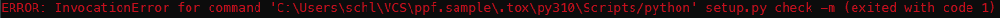

# Pure pyproject.toml

* python3.5 fails when setup.py is missing
* python3.6 fails to properly install check-manifest, flake8
* python3.7 works

+ dummy setup.py

* python3.5 does not fail due to setup.py anymore. But it fails to properly
  install check-manifest, flake8. Apparently, there is a problem running
  pip install .\[test\]

# Testing

needs setuptools>=40.5.0 because we run `python setup.py check -m` and
earlier version do not understand the [option.data_files] section in
our setup.cfg.

# (Fixed) Issues

* tox.ini: Don't use '{envbindir}/pytest' (or similar). This works on
           POSIX but not on Windows (due to the slash).
           Instead, simply use 'pytest'
  
